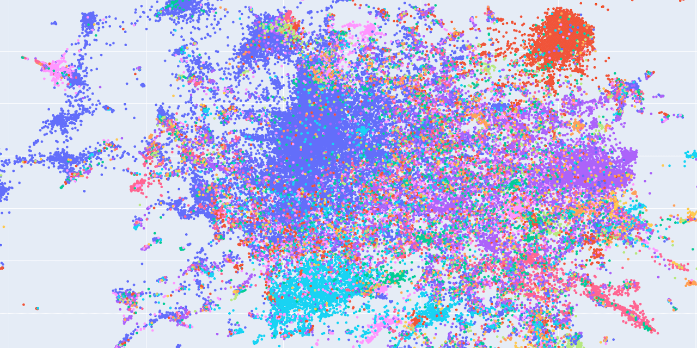

[](https://github.com/webis-de/archive-query-log/actions/workflows/ci.yml)
[](https://codecov.io/github/webis-de/archive-query-log/)
[](https://github.com/webis-de/archive-query-log/issues)
[](https://github.com/webis-de/archive-query-log/commits)
[](LICENSE)

# 📜 The Archive Query Log

Mining Millions of Search Result Pages of Hundreds of Search Engines from 25&nbsp;Years of Web Archives.

[Start now](#tldr) by scraping your own query log [here](#tldr). Or look at our [example files](data/examples).



## Contents

- [Installation](#installation)
- [Usage](#tldr)
- [Development](#development)
- [Contribute](#contribute)
- [Abstract](#abstract)

## Installation

1. Install [Python 3.10](https://python.org/downloads/)
2. Create and activate virtual environment:
    ```shell
    python3.10 -m venv venv/
    source venv/bin/activate
    ```
4. Install dependencies:
    ```shell
    pip install -e .
    ```

## Usage

To quickly scrape a sample query log, jump to the [TL;DR](#tldr).

If you want to learn more about each step here are some more detailed guides:

1. [Search providers](#1-search-providers)
2. [Fetch archived URLs](#2-archived-urls)
3. [Parse archived query URLs](#3-archived-query-urls)
4. [Download archived raw SERPs](#4-archived-raw-serps)
5. [Parse archived SERPs](#5-archived-parsed-serps)

### TL;DR

Let's start with a small example and construct a query log for the [ChatNoir](https://chatnoir.eu) search engine:

1. `python -m web_archive_query_log make archived-urls chatnoir`
2. `python -m web_archive_query_log make archived-query-urls chatnoir`
3. `python -m web_archive_query_log make archived-raw-serps chatnoir`
4. `python -m web_archive_query_log make archived-parsed-serps chatnoir`

Got the idea? Now you're ready to scrape your own query logs! To scale things up and understand the data, just keep on reading. For more details on how to add more search providers, see [below](#contribute).

### 1. Search providers

Manually or semi-automatically collect a list of search providers that you would like to scrape query logs from.

The list of search providers should be stored in a single [YAML][yaml-spec] file at [`data/selected-services.yaml`](data/selected-services.yaml) and contain one entry per search provider, like shown below:

```yaml
- name: string               # search providers name (alexa_domain - alexa_public_suffix)
  public_suffix: string      # public suffix (https://publicsuffix.org/) of alexa_domain
  alexa_domain: string       # domain as it appears in Alexa top-1M ranks
  alexa_rank: int            # rank from fused Alexa top-1M rankings
  category: string           # manual annotation
  notes: string              # manual annotation
  input_field: bool          # manual annotation
  search_form: bool          # manual annotation
  search_div: bool           # manual annotation
  domains: # known domains of the search providers (including the main domain)
    - string
    - string
    - ...
  query_parsers: # query parsers in order of precedence
    - pattern: regex
      type: query_parameter    # for URLs like https://example.com/search?q=foo
      parameter: string
    - pattern: regex
      type: fragment_parameter # for URLs like https://example.com/search#q=foo
      parameter: string
    - pattern: regex
      type: query_parameter    # for URLs like https://example.com/search/foo
      path_prefix: string
    - ...
  page_parsers: # page number parsers in order of precedence
    - pattern: regex
      type: query_parameter    # for URLs like https://example.com/search?page=2
      parameter: string
    - ...
  offset_parsers: # page offset parsers in order of precedence
    - pattern: regex
      type: query_parameter    # for URLs like https://example.com/search?start=11
      parameter: string
    - ...
  interpreted_query_parsers: # interpreted query parsers in order of precedence
    - ...
  results_parsers: # search result and snippet parsers in order of precedence
    - ...
- ...
```

In the source code, a search provider corresponds to the Python class [`Service`](archive_query_log/model/__init__.py).

### 2. Archived URLs

Fetch all archived URLs for a search provider from the Internet Archive's Wayback Machine.

You can run this step with the following command line, where `<PROVIDER>` is the name of the search provider you want to fetch archived URLs from:

```shell:
python -m web_archive_query_log make archived-urls <PROVIDER>
```

This will create multiple files in the `archived-urls` subdirectory under the [data directory](#pro-tip--specify-a-custom-data-directory), based on the search provider's name (`<PROVIDER>`), domain (`<DOMAIN>`), and the Wayback Machine's CDX [page number][cdx-pagination] (`<CDXPAGE>`) from which the URLs were originally fetched:

```
<DATADIR>/archived-urls/<PROVIDER>/<DOMAIN>/<CDXPAGE>.jsonl.gz
```

Here, the `<CDXPAGE>` is a 10-digit number with leading zeros, e.g., `0000000001`.

Each individual file is a GZIP-compressed [JSONL][jsonl-spec] file with one archived URL per line, in arbitrary order. Each line contains the following fields:

```json
{
  "url": "string",
  // archived URL
  "timestamp": "int"
  // archive timestamp as POSIX integer
}
```

In the source code, an archived URL corresponds to the Python class [`ArchivedUrl`](archive_query_log/model/__init__.py).

### 3. Archived Query URLs

Parse and filter archived URLs that contain a query and may point to a search engine result page (SERP).

You can run this step with the following command line, where `<PROVIDER>` is the name of the search provider you want to parse query URLs from:

```shell:
python -m web_archive_query_log make archived-query-urls <PROVIDER>
```

This will create multiple files in the `archived-query-urls` subdirectory under the [data directory](#pro-tip--specify-a-custom-data-directory), based on the search provider's name (`<PROVIDER>`), domain (`<DOMAIN>`), and the Wayback Machine's CDX [page number][cdx-pagination] (`<CDXPAGE>`) from which the URLs were originally fetched:

```
<DATADIR>/archived-query-urls/<PROVIDER>/<DOMAIN>/<CDXPAGE>.jsonl.gz
```

Here, the `<CDXPAGE>` is a 10-digit number with leading zeros, e.g., `0000000001`.

Each individual file is a GZIP-compressed [JSONL][jsonl-spec] file with one archived query URL per line, in arbitrary order. Each line contains the following fields:

```json
{
  "url": "string",
  // archived URL
  "timestamp": "int",
  // archive timestamp as POSIX integer
  "query": "string",
  // parsed query
  "page": "int",
  // result page number (optional)
  "offset": "int"
  // result page offset (optional)
}
```

In the source code, an archived query URL corresponds to the Python class [`ArchivedQueryUrl`](archive_query_log/model/__init__.py).

### 4. Archived Raw SERPs

Download the raw HTML content of archived search engine result pages (SERPs).

You can run this step with the following command line, where `<PROVIDER>` is the name of the search provider you want to download raw SERP HTML contents from:

```shell:
python -m web_archive_query_log make archived-raw-serps <PROVIDER>
```

This will create multiple files in the `archived-urls` subdirectory under the [data directory](#pro-tip--specify-a-custom-data-directory), based on the search provider's name (`<PROVIDER>`), domain (`<DOMAIN>`), and the Wayback Machine's CDX [page number][cdx-pagination] (`<CDXPAGE>`) from which the URLs were originally fetched. Archived raw SERPs are stored as 1GB-sized WARC chunk files, that is, WARC chunks are "filled" sequentially up to a size of 1GB each. If a chunk is full, a new chunk is created.

```
<DATADIR>/archived-raw-serps/<PROVIDER>/<DOMAIN>/<CDXPAGE>/<WARCCHUNK>.jsonl.gz
```

Here, the `<CDXPAGE>` and `<WARCCHUNK>` are both 10-digit numbers with leading zeros, e.g., `0000000001`.

Each individual file is a GZIP-compressed [WARC][warc-spec] file with one WARC request and one WARC response per archived raw SERP. WARC records are arbitrarily ordered within or across chunks, but the WARC request and response for the same archived query URL are kept together. The archived query URL is stored in the WARC request's and response's `Archived-URL` field in [JSONL][jsonl-spec] format (the same format as in the previous step):

```json
{
  "url": "string",
  // archived URL
  "timestamp": "int",
  // archive timestamp as POSIX integer
  "query": "string",
  // parsed query
  "page": "int",
  // result page number (optional)
  "offset": "int"
  // result page offset (optional)
}
```

In the source code, an archived raw SERP corresponds to the Python class [`ArchivedRawSerp`](archive_query_log/model/__init__.py).

### 5. Archived Parsed SERPs

Parse and filter archived SERPs from raw contents.

You can run this step with the following command line, where `<PROVIDER>` is the name of the search provider you want to parse SERPs from:

```shell:
python -m web_archive_query_log make archived-parsed-serps <PROVIDER>
```

This will create multiple files in the `archived-serps` subdirectory under the [data directory](#pro-tip--specify-a-custom-data-directory), based on the search provider's name (`<PROVIDER>`), domain (`<DOMAIN>`), and the Wayback Machine's CDX [page number][cdx-pagination] (`<CDXPAGE>`) from which the URLs were originally fetched:

```
<DATADIR>/archived-serps/<PROVIDER>/<DOMAIN>/<CDXPAGE>.jsonl.gz
```

Here, the `<CDXPAGE>` is a 10-digit number with leading zeros, e.g., `0000000001`.

Each individual file is a GZIP-compressed [JSONL][jsonl-spec] file with one archived parsed SERP per line, in arbitrary order. Each line contains the following fields:

```json
{
  "url": "string",
  // archived URL
  "timestamp": "int",
  // archive timestamp as POSIX integer
  "query": "string",
  // parsed query
  "page": "int",
  // result page number (optional)
  "offset": "int",
  // result page offset (optional)
  "interpreted_query": "string",
  // query displayed on the SERP (e.g. with spelling correction; optional)
  "results": [
    {
      "url": "string",
      // URL of the result
      "title": "string",
      // title of the result
      "snippet": "string"
      // snippet of the result (highlighting normalized to <em>)
    },
    ...
  ]
}
```

In the source code, an archived parsed SERP corresponds to the Python class [`ArchivedParsedSerp`](archive_query_log/model/__init__.py).

### Pro Tip: Specify a Custom Data Directory

By default, the data directory is set to [`data/`](data). You can change this with the `--data-directory` option, e.g.:

```shell
python -m archive_query_log make archived-urls --data-directory /mnt/ceph/storage/data-in-progress/data-research/web-search/web-archive-query-log/
```

### Pro Tip: Limit Scraping for Testing

If the search provider you're scraping queries for is very large and has many domains, testing your settings on a smaller sample from that search provider can be helpful. You can specify a single domain to scrape from like this:

```shell
python -m archive_query_log make archived-urls <PROVIDER> <DOMAIN>
```

If a domain is very popular and therefore has many archived URLs,
you can further limit the number of archived URLs to scrape by selecting
a [page](https://github.com/internetarchive/wayback/blob/master/wayback-cdx-server/README.md#pagination-api)
from the Wayback Machine's
[CDX API](https://github.com/internetarchive/wayback/blob/master/wayback-cdx-server/README.md#pagination-api):

```shell
python -m archive_query_log make archived-urls <PROVIDER> <DOMAIN> <CDX_PAGE>
```

## Development

Run tests:
```shell
flake8 archive_query_log
pylint -E archive_query_log
pytest archive_query_log
```

## Contribute

If you've found an important search provider to be missing from this query log, please suggest it by creating an [issue][repo-issues]. We also very gratefully accept [pull requests][repo-prs] for adding [search providers](#1-search-providers) or new parser configurations!

If you're unsure about anything, post an [issue][repo-issues], or contact us:
- [heinrich.reimer@uni-jena.de](mailto:heinrich.reimer@uni-jena.de)
- [s.schmidt@uni-leipzig.de](mailto:s.schmidt@uni-leipzig.de)
- [maik.froebe@uni-jena.de](mailto:maik.froebe@uni-jena.de)
- [lukas.gienapp@uni-leipzig.de](mailto:lukas.gienapp@uni-leipzig.de)
- [harry.scells@uni-leipzig.de](mailto:harry.scells@uni-leipzig.de)
- [benno.stein@uni-weimar.de](mailto:benno.stein@uni-weimar.de)
- [matthias.hagen@uni-jena.de](mailto:matthias.hagen@uni-jena.de)
- [martin.potthast@uni-leipzig.de](mailto:martin.potthast@uni-leipzig.de)

## Abstract

The Archive Query Log (AQL) is a previously unused, comprehensive query log collected at the Internet Archive over the last 25 years. Its first version includes 356 million queries, 166 million search result pages, and 1.7 billion search results across 550 search providers. Although many query logs have been studied in the literature, the search providers that own them generally do not publish their logs to protect user privacy and vital business data. Of the few query logs publicly available, none combines size, scope, and diversity. The AQL is the first to do so, enabling research on new retrieval models and (diachronic) search engine analyses. Provided in a privacy-preserving manner, it promotes open research as well as more transparency and accountability in the search industry.

[repo-issues]: https://git.webis.de/code-research/web-search/web-archive-query-log/-/issues

[repo-prs]: https://git.webis.de/code-research/web-search/web-archive-query-log/-/merge_requests

[cdx-pagination]: https://github.com/internetarchive/wayback/blob/master/wayback-cdx-server/README.md#pagination-api

[warc-spec]: https://iipc.github.io/warc-specifications/specifications/warc-format/warc-1.1/

[jsonl-spec]: https://jsonlines.org/

[yaml-spec]: https://yaml.org/
