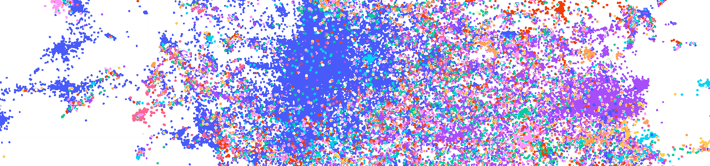

[](https://doi.org/10.1145/3539618.3591890)
[](https://arxiv.org/abs/2304.00413)
[](https://paperswithcode.com/paper/the-archive-query-log-mining-millions-of)  
[](https://github.com/webis-de/archive-query-log/actions/workflows/ci.yml)
[](https://codecov.io/github/webis-de/archive-query-log/)
[](https://github.com/webis-de/archive-query-log/graphs/contributors)  
[](https://github.com/webis-de/archive-query-log/issues)
[](https://github.com/webis-de/archive-query-log/pulls)
[](https://github.com/webis-de/archive-query-log/commits)
[](LICENSE)

# 📜 The Archive Query Log

Mining Millions of Search Result Pages of Hundreds of Search Engines from 25&nbsp;Years of Web Archives.

[](docs/queries-tsne.png)

Start now by running [your custom analysis/experiment](#integrations), scraping [your own query log](#crawling), 
or just look at [our example files](data/examples).

## Contents

- [Integrations](#integrations)
- [Crawling](#crawling)
- [Development](#development)
- [Contribute](#contribute)
- [Abstract](#abstract)

## Integrations

### Running Experiments on the AQL

The data in the Archive Query Log is highly sensitive (still, you
can [re-crawl everything from the Wayback Machine](#crawling)). For that reason, we ensure that custom experiments or
analyses can not leak sensitive data (please [get in touch](#contribute) if you have questions) by
using [TIRA](https://tira.io) as a platform for custom analyses/experiments. In TIRA, you submit a Docker image that
implements your experiment. Your software is then executed in sandboxed mode (without internet connection) to ensure
that your software does not leak sensitive information. After your software execution finished, administrators will
review your submission and unblind it so that you can access the outputs.  
Please refer to our [dedicated TIRA tutorial](integrations/tira/README.md) as starting point for your experiments.

## Crawling

For running the CLI and crawl a query log on your own machine, 
please refer to the [instructions for single-machine deployments](#single-machine-pypidocker).
If instead you want to scale up and run the crawling pipelines on a cluster,
please refer to the [instructions for cluster deployments](#cluster-helmkubernetes).

### Single-Machine (PyPi/Docker)

To run the Archive Query Log CLI on your machine, 
you can either use our [PyPi package](#installation-pypi) or the [Docker image](#installation-docker).
(If you absolutely need to, you can also install the [Python CLI](#installation-python-from-source) 
or the Docker image from source.)

#### Installation (PyPi)

First you need to install [Python 3.10](https://python.org/downloads/) and 
[pipx](https://pypa.github.io/pipx/installation/) (this allows you to install the AQL CLI in a virtual environment).
Then, you can install the Archive Query Log CLI by running:
```shell
pipx install archive-query-log
```

Now you can run the Archive Query Log CLI by running:
```shell
aql --help
```

#### Installation (Python from source)

<details>

First install [Python 3.10](https://python.org/downloads/), and clone this repository.
From inside the repository directory, create a virtual environment and activate it:
```shell
python3.10 -m venv venv/
source venv/bin/activate
```
Now you can install the Archive Query Log CLI by running:
```shell
pip install -e .
```

**Note:** The commands below use the syntax of the [PyPi installation](#installation-pypi).
To run the same commands with the local Python installation, replace `aql` with `python -m archive_query_log`,
for example:

```shell
python -m archive_query_log --help
```

</details>

#### Installation (Docker)

You only need to install [Docker](https://docs.docker.com/get-docker/).

**Note:** The commands below use the syntax of the [PyPi installation](#installation-pypi).
To run the same commands with the Docker installation, replace `aql`
with `docker run -it -v "$(pwd)"/config.override.yml:/workspace/config.override.yml ghcr.io/webis-de/archive-query-log`,
for example:

```shell
docker run -it -v "$(pwd)"/config.override.yml:/workspace/config.override.yml ghcr.io/webis-de/archive-query-log --help
```

#### Installation (Docker from source)

<details>

First install [Docker](https://docs.docker.com/get-docker/), and clone this repository.
From inside the repository directory, build the Docker image like this:

```shell
docker build -t aql .
```

**Note:** The commands below use the syntax of the [PyPi installation](#installation-pypi).
To run the same commands with the Docker installation, replace `aql`
with `docker run -it -v "$(pwd)"/config.override.yml:/workspace/config.override.yml aql`,
for example:

```shell
docker run -it -v "$(pwd)"/config.override.yml:/workspace/config.override.yml aql --help
```

</details>

#### Configuration

Crawling the Archive Query Log requires access to an Elasticsearch cluster.
To configure access to the Elasticsearch cluster, 
add a `config.override.yml` file in the current directory, with the following contents.
Replace the placeholders with your actual credentials:

```yaml
es:
  host: "<HOST>"
  port: 9200
  username: "<USERNAME>"
  password: "<PASSWORD>"
```

#### Add an archive service

```shell
aql archives add
```

#### Add a search provider

```shell
aql providers add
```

#### Build source pairs

```shell
aql sources build
```

#### Fetch captures

```shell
aql captures fetch
```

### Cluster (Helm/Kubernetes)
Running the Archive Query Log on a cluster is recommended for large-scale crawls.
We provide a Helm chart that automatically starts crawling and parsing jobs for you
and stores the results in an Elasticsearch cluster.

#### Installation
Just install [Helm](https://helm.sh/docs/intro/quickstart/) and configure `kubectl` for your cluster.

#### Configuration

Crawling the Archive Query Log requires access to an Elasticsearch cluster.
Configure the Elasticsearch credentials in a `values.override.yaml` file like this:

```yaml
elasticsearch:
  host: "<HOST>"
  port: 9200
  username: "<USERNAME>"
  password: "<PASSWORD>"
```

#### Deployment

Let's deploy the Helm chart on the cluster (we're testing first with `--dry-run` to see if everything works):

```shell
helm upgrade --install --values helm/archive-query-log/values.override.yaml --dry-run archive-query-log helm/archive-query-log
```

If everything worked and the output looks good, you can remove the `--dry-run` flag to actually deploy the chart.

#### Uninstall

If you no longer need the chart, you can uninstall it:

```shell
helm uninstall archive-query-log
```

## Citation

If you use the Archive Query Log dataset or the crawling code in your research, please cite the following paper
describing the AQL and its use-cases:

> Heinrich Reimer, Sebastian Schmidt, Maik Fröbe, Lukas Gienapp, Harrisen Scells, Benno Stein, Matthias Hagen, and
> Martin Potthast. [The Archive Query Log: Mining Millions of Search Result Pages of Hundreds of Search Engines 
> from 25 Years of Web Archives.](https://webis.de/publications.html?q=archive#reimer_2023) In Hsin-Hsi Chen et al., 
> editors, _46th International ACM SIGIR Conference on Research and Development in Information Retrieval (SIGIR 2023)_, 
> pages 2848–2860, July 2023. ACM.

You can use the following BibTeX entry for citation:

```bibtex
@InProceedings{reimer:2023,
    author = {{Jan Heinrich} Reimer and Sebastian Schmidt and Maik Fr{\"o}be and Lukas Gienapp and Harrisen Scells and Benno Stein and Matthias Hagen and Martin Potthast},
    booktitle = {46th International ACM SIGIR Conference on Research and Development in Information Retrieval (SIGIR 2023)},
    doi = {10.1145/3539618.3591890},
    editor = {Hsin{-}Hsi Chen and Wei{-}Jou (Edward) Duh and Hen{-}Hsen Huang and Makoto P. Kato and Josiane Mothe and Barbara Poblete},
    ids = {potthast:2023u},
    isbn = {9781450394086},
    month = jul,
    numpages = 13,
    pages = {2848--2860},
    publisher = {ACM},
    site = {Taipei, Taiwan},
    title = {{The Archive Query Log: Mining Millions of Search Result Pages of Hundreds of Search Engines from 25 Years of Web Archives}},
    url = {https://dl.acm.org/doi/10.1145/3539618.3591890},
    year = 2023
}
```

## Development

Refer to the local [Python installation](#installation-python-from-source) instructions to set up the development
environment and install the dependencies.

After having implemented a new feature, you should the check code format, inspect common LINT errors, 
and run all unit tests with the following commands:

```shell
flake8 archive_query_log  # Code format
pylint archive_query_log  # LINT errors
mypy archive_query_log  # Static typing
bandit -c pyproject.toml -r archive_query_log  # Security
pytest archive_query_log  # Unit tests
```

### Add new tests for parsers

At the moment, our workflow for adding new tests for parsers goes like this:

1. Select the number of tests to run per service and the number of services.
2. Auto-generate unit tests and download WARCs
   with [generate_tests.py](archive_query_log/legacy/results/test/generate_tests.py)
3. Run the tests.
4. Failing tests will open a diff editor with the approval and a web browser tab with the Wayback URL.
5. Use the web browser dev tools to find the query input field and search result CSS paths.
6. Close diffs and tabs and re-run tests.

## Contribute

If you've found an important search provider to be missing from this query log,
please suggest it by creating an [issue](https://github.com/webis-de/archive-query-log/issues).
We also very gratefully accept [pull requests](https://github.com/webis-de/archive-query-log/pulls)
for adding search providers or new parser configurations!

If you're unsure about anything, post an [issue](https://github.com/webis-de/archive-query-log/issues/new), 
or contact us:

- [heinrich.reimer@uni-jena.de](mailto:heinrich.reimer@uni-jena.de)
- [s.schmidt@uni-leipzig.de](mailto:s.schmidt@uni-leipzig.de)
- [maik.froebe@uni-jena.de](mailto:maik.froebe@uni-jena.de)
- [lukas.gienapp@uni-leipzig.de](mailto:lukas.gienapp@uni-leipzig.de)
- [harry.scells@uni-leipzig.de](mailto:harry.scells@uni-leipzig.de)
- [benno.stein@uni-weimar.de](mailto:benno.stein@uni-weimar.de)
- [matthias.hagen@uni-jena.de](mailto:matthias.hagen@uni-jena.de)
- [martin.potthast@uni-leipzig.de](mailto:martin.potthast@uni-leipzig.de)

We're happy to help!

## License

This repository is released under the [MIT license](LICENSE).
Files in the `data/` directory are exempt from this license.
If you use the AQL in your research, we'd be glad if you'd [cite us](#citation).

## Abstract

The Archive Query Log (AQL) is a previously unused, comprehensive query log collected at the Internet Archive over the
last 25 years. Its first version includes 356 million queries, 166 million search result pages, and 1.7 billion search
results across 550 search providers. Although many query logs have been studied in the literature, the search providers
that own them generally do not publish their logs to protect user privacy and vital business data. Of the few query logs
publicly available, none combines size, scope, and diversity. The AQL is the first to do so, enabling research on new
retrieval models and (diachronic) search engine analyses. Provided in a privacy-preserving manner, it promotes open
research as well as more transparency and accountability in the search industry.
