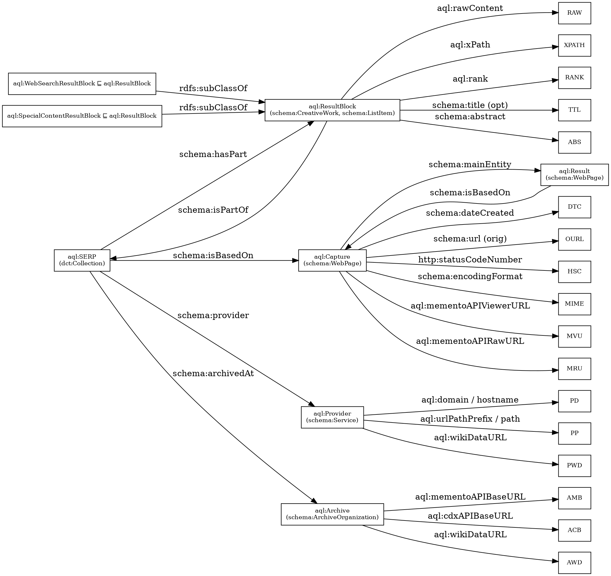

# Schema (Graphviz)

```dot
digraph KG {
  rankdir=LR;
  node [shape=box, fontsize=10];

  # Classes
  SERP [label="aql:SERP\n(dct:Collection)"];
  RB   [label="aql:ResultBlock\n(schema:CreativeWork, schema:ListItem)"];
  WRB  [label="aql:WebSearchResultBlock ⊑ aql:ResultBlock"];
  SRB  [label="aql:SpecialContentResultBlock ⊑ aql:ResultBlock"];
  RES  [label="aql:Result\n(schema:WebPage)"];
  CAP  [label="aql:Capture\n(schema:WebPage)"];
  PRO  [label="aql:Provider\n(schema:Service)"];
  ARC  [label="aql:Archive\n(schema:ArchiveOrganization)"];

  # Core relations
  SERP -> RB  [label="schema:hasPart"];
  RB   -> SERP [label="schema:isPartOf"];
  RB   -> RAW  [label="aql:rawContent"];
  RB   -> XPATH [label="aql:xPath"];
  RB   -> RANK [label="aql:rank"];
  RB   -> TTL  [label="schema:title (opt)"];
  RB   -> ABS  [label="schema:abstract"];

  WRB -> RB [label="rdfs:subClassOf"];
  SRB -> RB [label="rdfs:subClassOf"];

  SERP -> PRO [label="schema:provider"];
  SERP -> ARC [label="schema:archivedAt"];
  SERP -> CAP [label="schema:isBasedOn"];

  CAP -> RES [label="schema:mainEntity"];
  RES -> CAP [label="schema:isBasedOn"];

  # Provider details
  PRO -> PD [label="aql:domain / hostname"];
  PRO -> PP [label="aql:urlPathPrefix / path"];
  PRO -> PWD [label="aql:wikiDataURL"];

  # Capture details
  CAP -> DTC [label="schema:dateCreated"];
  CAP -> OURL [label="schema:url (orig)"];
  CAP -> HSC [label="http:statusCodeNumber"];
  CAP -> MIME [label="schema:encodingFormat"];
  CAP -> MVU [label="aql:mementoAPIViewerURL"];
  CAP -> MRU [label="aql:mementoAPIRawURL"];

  # Archive details
  ARC -> AMB [label="aql:mementoAPIBaseURL"];
  ARC -> ACB [label="aql:cdxAPIBaseURL"];
  ARC -> AWD [label="aql:wikiDataURL"];
}
```