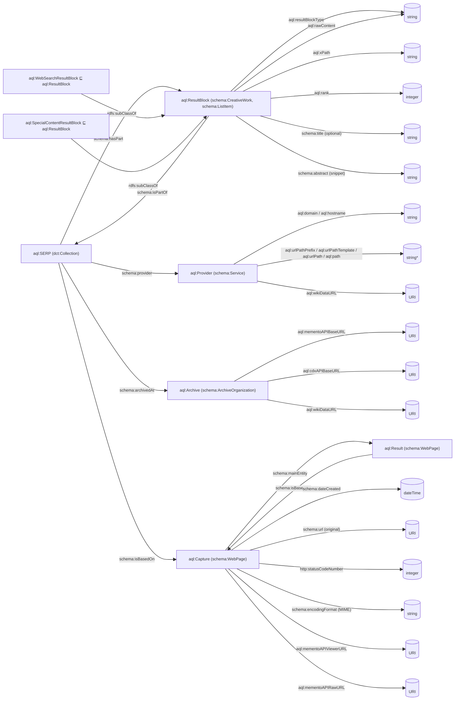

# Schema (Mermaid)

...

```mermaid
%%{ init: { 'themeVariables': { 'fontSize': '10px', 'lineHeight': '10px' } } }%%
graph LR
  %% Classes
  SERP["aql:SERP (dct:Collection)"]
  RB["aql:ResultBlock (schema:CreativeWork, schema:ListItem)"]
  WRB["aql:WebSearchResultBlock ⊑ aql:ResultBlock"]
  SRB["aql:SpecialContentResultBlock ⊑ aql:ResultBlock"]
  RES["aql:Result (schema:WebPage)"]
  CAP["aql:Capture (schema:WebPage)"]
  PRO["aql:Provider (schema:Service)"]
  ARC["aql:Archive (schema:ArchiveOrganization)"]

  %% Core relations
  SERP -- "schema:hasPart" --> RB
  RB   -- "schema:isPartOf" --> SERP
  RB   -- "aql:resultBlockType" --> RAW[("string")]
  RB   -- "aql:xPath" --> XPATH[("string")]
  RB   -- "aql:rawContent" --> RAW[("string")]
  RB   -- "aql:rank" --> RANK[("integer")]
  RB   -- "schema:title (optional)" --> TTL[("string")]
  RB   -- "schema:abstract (snippet)" --> ABS[("string")]

  WRB -- "rdfs:subClassOf" --> RB
  SRB -- "rdfs:subClassOf" --> RB

  SERP -- "schema:provider" --> PRO
  SERP -- "schema:archivedAt" --> ARC
  SERP -- "schema:isBasedOn" --> CAP

  CAP -- "schema:mainEntity" --> RES
  RES -- "schema:isBasedOn" --> CAP

  %% Provider details (multiple allowed)
  PRO -- "aql:domain / aql:hostname" --> PD[("string")]
  PRO -- "aql:urlPathPrefix / aql:urlPathTemplate / aql:urlPath / aql:path" --> PP[("string*")]
  PRO -- "aql:wikiDataURL" --> PWD[("URI")]

  %% Capture details
  CAP -- "schema:dateCreated" --> DTC[("dateTime")]
  CAP -- "schema:url (original)" --> OURL[("URI")]
  CAP -- "http:statusCodeNumber" --> HSC[("integer")]
  CAP -- "schema:encodingFormat (MIME)" --> MIME[("string")]
  CAP -- "aql:mementoAPIViewerURL" --> MVU[("URI")]
  CAP -- "aql:mementoAPIRawURL" --> MRU[("URI")]

  %% Archive details
  ARC -- "aql:mementoAPIBaseURL" --> AMB[("URI")]
  ARC -- "aql:cdxAPIBaseURL" --> ACB[("URI")]
  ARC -- "aql:wikiDataURL" --> AWD[("URI")]
```

