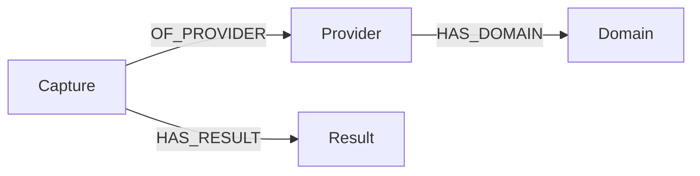

# KG Overview

Below is a small schema sketch.

```mermaid
graph LR
  Provider["Provider"]
  Domain["Domain"]
  Capture["Capture"]
  Result["Result"]

  Provider -- HAS_DOMAIN --> Domain
  Capture  -- OF_PROVIDER --> Provider
  Capture  -- HAS_RESULT  --> Result


```